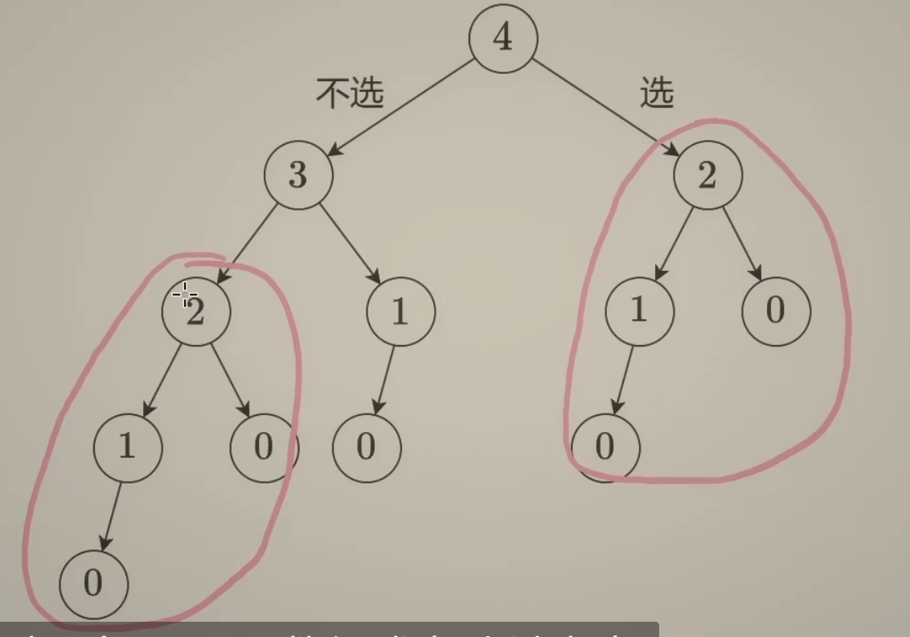

## 198 打家劫舍


题目 198：打家劫舍（House Robber）是一个经典的动态规划问题，问题描述如下：

你是一个小偷，计划偷窃沿街的房屋。每间房屋都有一定的现金价值（非负整数），而相邻的房屋有安全警报系统连接。如果你在两间相邻的房屋中偷窃，警报系统将触发。你的目标是选择一系列房屋进行偷窃，确保相邻的房屋不被同时偷窃，从而获得最大的现金价值。

### 输入
- 一个整数数组 `nums`，表示每间房屋的现金价值，其中 `nums[i]` 是第 `i` 间房屋的现金。

### 输出
- 返回你可以偷窃到的最高现金价值。

### 示例
输入:
```
nums = [1, 2, 3, 1]
```
输出:
```
4
```
解释: 偷窃第 1 间和第 3 间房屋，获得 1 + 3 = 4。

### 约束
- `1 <= nums.length <= 100`
- `0 <= nums[i] <= 400`


### 递归回溯
这个就是从上到下，从大的分解到小分


```py
class Solution:
    def rob(self,nums):
        n = len(nums)
        def dfs(i):
            if i <0:
                return 0 
            res = max(dfs(i-1),dfs(i-2)+nums)
            return res
        return dfs(n-1)

```


记忆搜索其实只要一个装饰器就行，cache，其实就是hashmap
```py
class Solution:
    def rob(self,nums):
        n = len(nums)
        @cache
        def dfs(i):
            if i <0:
                return 0 
            res = max(dfs(i-1),dfs(i-2)+nums)
            return res
        return dfs(n-1)

#本质上cache就是用hashmap来记录所有的
# 初始化n个【-1】不可能的，然后记录每一次得到的值 cache[i] = res, 在下一步计算前，查看cache有没有，就index那个数字
# 有的话直接返回那个数字好了，不用返回结果，  if cache[i] != -1: return cache[i]
    def rob(self,nums):
        n = len(nums)
        cache = [-1] *n
        def dfs(i):
            if i <0:
                return 0 
            if cache[i] != -1:
                return cache[i]
            res = max(dfs(i-1),dfs(i-2)+nums)
            cache[i] = res
            return res
        return dfs(n-1)

```
#### 时间复杂度怎么算，状态个数*单个状态的处理的时间O（n*1），这题的空间复杂度也是O
##### 不过这边都是从上往下，如果是递归的话，就从下往上


```py


```