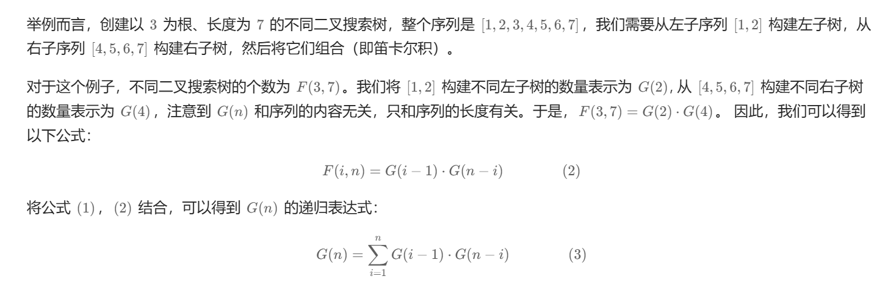

### burst ballons

```py
class Solution:
    def maxCoins(self, nums: List[int]) -> int:
        nums = [1] + nums + [1]
        @functools.lru_cache(None)
        def dfs(i: int, j: int) -> int:
            # 基本情况：如果 i 和 j 之间没有气球（即 i + 1 == j），返回 0
            if i + 1 == j: return 0
             # 尝试所有可能的位置 `k`，将气球 `k` 作为最后一个爆破的气球
            # 计算在 i 到 j 范围内，爆破气球 k 所得到的最大金币数
            return max(dfs(i, k)+ nums[i] * nums[k] * nums[j] + dfs(k, j) for k in range(i + 1, j))
        return dfs(0, len(nums) - 1)

# # 对于 f[i][j]，我们枚举区间 [i,j] 内的所有位置 k，假设 k 是最后一个戳破的气球，那么我们可以得到如下状态转移方程：

# # f[i][j]=max(f[i][j],f[i][k]+f[k][j]+arr[i]×arr[k]×arr[j])
# # 从大到小遍历 i：保证在计算 f[i][j] 时，左侧子区间 [i, k] 已经被计算出来。
# # 从小到大遍历 j：保证在计算 f[i][j] 时，右侧子区间 [k, j] 已经被计算出来。
# class Solution:
class Solution:
    def maxCoins(self, nums: List[int]) -> int:
        n = len(nums)
        nums_ = [1] + [x for x in nums] + [1]     # 加上边界的数组，统一处理
        dp = [[0] * (n + 2) for _ in range(n + 2)] # dp[i][j]表示数组范围nums_(i, j)可以获得的最大硬币数
        # 逆序枚举左边界i，左边界最大为n-1，因为区间(i,j)至少要包含一个元素
        for i in range(n - 1, -1, -1):
            # 正序枚举右边界，右边界最大为n+1
            for j in range(i + 2, n + 2):
                # 枚举区间中每一个元素作为区间中最后去除的元素，得到区间(i,j)可以获得的最大硬币数
                for k in range(i + 1, j):
                    # k作为去掉的元素，得到的硬币数为nums[i]*nums[k]*nums[j]，索引越界则值为1
                    # 而剩下的部分就是子问题，区间(i,k)和(k,j)可以获得的最大硬币数
                    dp[i][j] = max(dp[i][j], dp[i][k] + nums_[i] * nums_[k] * nums_[j] + dp[k][j])
        return dp[0][n+1]

```


### 96 diferent binary tree(https://leetcode.cn/problems/unique-binary-search-trees/description/)



```py

class Solution:
    def numTrees(self, n):
        """
        :type n: int
        :rtype: int
        """
        G = [0]*(n+1)
        G[0], G[1] = 1, 1

        for i in range(2, n+1):
            for j in range(1, i+1):
                G[i] += G[j-1] * G[i-j]

        return G[n]

```