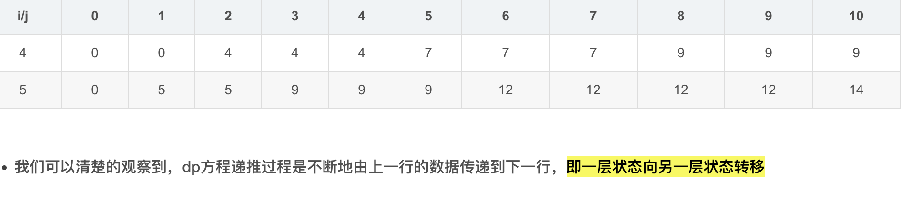
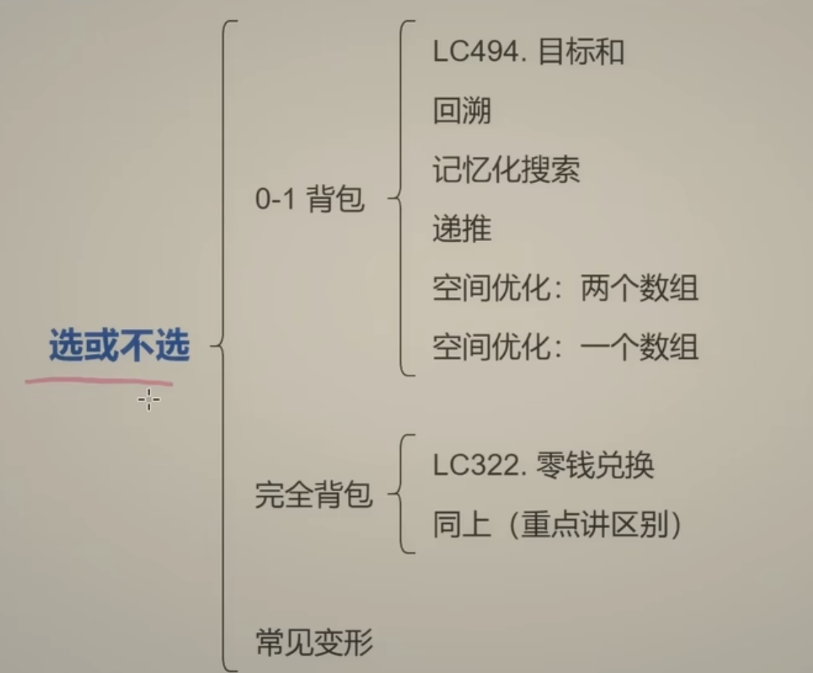

## 本质就是选或者不选

## 滚动数组优化要有想象力，类似这样的图在脑中，第二层由第一层的逆序更新来


https://algo.itcharge.cn/10.Dynamic-Programming/04.Knapsack-Problem/01.Knapsack-Problem-01/#_2-1-0-1-%E8%83%8C%E5%8C%85%E9%97%AE%E9%A2%98%E5%9F%BA%E6%9C%AC%E6%80%9D%E8%B7%AF


在这个动态规划实现中，`w + 1` 和 `size + 1` 是为了构造 `dp` 数组的维度，以便于处理边界情况，并使得代码更加简洁。具体解释如下：

### 1. `dp` 数组的大小为什么是 `dp[size + 1][W + 1]`

- `size + 1`：表示前 `i` 个物品，其中 `i` 从 `0` 到 `size`。
  - 我们使用从 `1` 到 `size` 的下标表示真实的物品编号，而 `0` 代表不选任何物品的情况。
  - 这样，`dp[0][w]` 表示不使用任何物品时可以达到的最大价值（显然为 0），为处理初始状态提供了方便。
  
- `W + 1`：表示背包的容量 `w` 从 `0` 到 `W`。
  - 这里的 `dp[i][0]` 表示背包容量为 `0` 时的最大价值（显然为 0）。
  - `dp[i][w]` 中的 `w` 从 `0` 到 `W`，这样可以方便地处理背包容量的边界情况。
 
### 使用 `size + 1` 和 `W + 1` 的好处

使用 `size + 1` 和 `W + 1` 的好处是：
- **简化边界条件**：因为可以在 `dp[0][*]` 行表示不选择任何物品的情况，且可以在 `dp[*][0]` 列表示背包容量为 0 的情况。这样，在状态转移时不需要额外处理边界情况，使得代码更加简洁。
- **方便状态转移**：从第 1 个物品到第 `size` 个物品的编号刚好对应下标 `1` 到 `size`，并且可以直接使用 `i-1` 作为下标访问 `weight` 和 `value` 数组。

### 代码中的转移公式解释

在代码的核心逻辑中：

```py
for i in range(1, size + 1):    # 枚举前 i 个物品,从1开始
    for w in range(W + 1):       # 枚举背包容量 w，从 0 到 W
        if w < weight[i - 1]:
            dp[i][w] = dp[i - 1][w]
        else:
            dp[i][w] = max(dp[i - 1][w], dp[i - 1][w - weight[i - 1]] + value[i - 1])

```

- `dp[i][w] = dp[i - 1][w]` 表示不选择第 `i` 个物品。
- `dp[i][w] = dp[i - 1][w - weight[i - 1]] + value[i - 1]` 表示选择第 `i` 个物品，并且要保证容量 `w` 足够放下该物品。
  
通过从 `1` 开始枚举 `i` 和 `w` 的值，代码能够方便地处理初始状态和边界情况。

### 总结

- `size + 1` 和 `W + 1` 是为了让 `dp` 数组的下标从 `0` 开始，便于处理不选任何物品和背包容量为 `0` 的情况。
- 这样设计的二维数组可以让动态规划过程更简洁，减少对边界条件的处理。

对于这段代码，时空复杂度分析如下：

### 时间复杂度

这段代码的时间复杂度是 **O(n * W)**，其中：

- `n` 是物品的数量（`size`），即 `len(weight)`。
- `W` 是背包的容量限制。

#### 解释：
- 在代码中，我们有两层嵌套循环：
  - 外层循环遍历物品 `i`，运行 `size` 次，即 `n` 次。
  - 内层循环遍历背包的容量 `w`，从 `0` 到 `W`，运行 `W + 1` 次。

因此，代码的总时间复杂度是 `O(n * W)`。

### 空间复杂度

这段代码的空间复杂度是 **O(n * W)**，因为它使用了一个二维数组 `dp`，其大小为 `(n + 1) x (W + 1)`，即 `dp[size + 1][W + 1]`。

#### 解释：
- `dp[i][w]` 数组用于存储前 `i` 件物品在容量 `w` 时的最大价值。
- 该数组的大小是 `(n + 1) * (W + 1)`，因此空间复杂度为 `O(n * W)`。

### 空间复杂度优化（滚动数组）

如果你想进一步优化空间复杂度，可以使用 **滚动数组** 技术，将空间复杂度从 `O(n * W)` 降低到 **O(W)**。

#### 滚动数组的思路：
- 在 `dp[i][w]` 的状态转移过程中，`dp[i][w]` 只依赖于 `dp[i-1][w]` 和 `dp[i-1][w - weight[i - 1]]`。
- 因此，我们可以用一维数组 `dp[w]` 代替二维数组 `dp[i][w]`。
- 更新 `dp` 时，从背包容量 `W` 开始倒序更新，这样可以避免覆盖当前物品依赖的上一个状态。

#### 使用滚动数组的代码示例：

```python
def zeroOnePackMethod1(weight: [int], value: [int], W: int):
    size = len(weight)
    dp = [0] * (W + 1)

    for i in range(size):
        for w in range(W, weight[i] - 1, -1): # 从 W 倒序到 weight[i]，不会到-1，exclusive 最后一个
            dp[w] = max(dp[w], dp[w - weight[i]] + value[i])

    return dp[W]
```

#### 优化后的空间复杂度

- 这种方法的空间复杂度为 **O(W)**，因为我们只使用了一维数组 `dp`，大小为 `W + 1`。

### 总结

- **未优化时**：
  - 时间复杂度：`O(n * W)`
  - 空间复杂度：`O(n * W)`

- **优化后（滚动数组）**：
  - 时间复杂度：`O(n * W)`
  - 空间复杂度：`O(W)`
好的，为了帮助你更好地理解 `0-1 背包问题` 的两种解法（**二维动态规划数组** 和 **一维滚动数组**），我将用示例数据展示它们的 `dp` 表格状态变化。我们使用以下示例：

### 示例

- 物品重量数组 `weight = [2, 3, 4, 5]`
- 物品价值数组 `value = [3, 4, 5, 6]`
- 背包容量 `W = 8`

我们将分别展示 **二维动态规划数组** 和 **一维滚动数组** 的 `dp` 表格状态变化。

---

### 解法 1：二维动态规划数组 `dp[i][w]`

在这个解法中，`dp[i][w]` 表示前 `i` 个物品中选择若干物品放入一个容量为 `w` 的背包时，可以获得的最大价值。

#### 初始状态：`dp` 全部为 0

| i\w | 0 | 1 | 2 | 3 | 4 | 5 | 6 | 7 | 8 |
|-----|---|---|---|---|---|---|---|---|---|
| 0   | 0 | 0 | 0 | 0 | 0 | 0 | 0 | 0 | 0 |

#### 状态转移过程

##### 处理第一个物品（重量 2，价值 3）

- 当 `w < 2` 时，无法放入第 1 个物品，`dp[1][w] = dp[0][w]`。
- 当 `w >= 2` 时，可以选择放入第 1 个物品，`dp[1][w] = max(dp[0][w], dp[0][w - 2] + 3)`。

| i\w | 0 | 1 | 2 | 3 | 4 | 5 | 6 | 7 | 8 |
|-----|---|---|---|---|---|---|---|---|---|
| 0   | 0 | 0 | 0 | 0 | 0 | 0 | 0 | 0 | 0 |
| 1   | 0 | 0 | 3 | 3 | 3 | 3 | 3 | 3 | 3 |

##### 处理第二个物品（重量 3，价值 4）

- 当 `w < 3` 时，无法放入第 2 个物品，`dp[2][w] = dp[1][w]`。
- 当 `w >= 3` 时，可以选择放入第 2 个物品，`dp[2][w] = max(dp[1][w], dp[1][w - 3] + 4)`。

| i\w | 0 | 1 | 2 | 3 | 4 | 5 | 6 | 7 | 8 |
|-----|---|---|---|---|---|---|---|---|---|
| 0   | 0 | 0 | 0 | 0 | 0 | 0 | 0 | 0 | 0 |
| 1   | 0 | 0 | 3 | 3 | 3 | 3 | 3 | 3 | 3 |
| 2   | 0 | 0 | 3 | 4 | 4 | 7 | 7 | 7 | 7 |

##### 处理第三个物品（重量 4，价值 5）

- 当 `w < 4` 时，无法放入第 3 个物品，`dp[3][w] = dp[2][w]`。
- 当 `w >= 4` 时，可以选择放入第 3 个物品，`dp[3][w] = max(dp[2][w], dp[2][w - 4] + 5)`。

| i\w | 0 | 1 | 2 | 3 | 4 | 5 | 6 | 7 | 8 |
|-----|---|---|---|---|---|---|---|---|---|
| 0   | 0 | 0 | 0 | 0 | 0 | 0 | 0 | 0 | 0 |
| 1   | 0 | 0 | 3 | 3 | 3 | 3 | 3 | 3 | 3 |
| 2   | 0 | 0 | 3 | 4 | 4 | 7 | 7 | 7 | 7 |
| 3   | 0 | 0 | 3 | 4 | 5 | 7 | 8 | 9 | 9 |

##### 处理第四个物品（重量 5，价值 6）

- 当 `w < 5` 时，无法放入第 4 个物品，`dp[4][w] = dp[3][w]`。
- 当 `w >= 5` 时，可以选择放入第 4 个物品，`dp[4][w] = max(dp[3][w], dp[3][w - 5] + 6)`。

| i\w | 0 | 1 | 2 | 3 | 4 | 5 | 6 | 7 | 8 |
|-----|---|---|---|---|---|---|---|---|---|
| 0   | 0 | 0 | 0 | 0 | 0 | 0 | 0 | 0 | 0 |
| 1   | 0 | 0 | 3 | 3 | 3 | 3 | 3 | 3 | 3 |
| 2   | 0 | 0 | 3 | 4 | 4 | 7 | 7 | 7 | 7 |
| 3   | 0 | 0 | 3 | 4 | 5 | 7 | 8 | 9 | 9 |
| 4   | 0 | 0 | 3 | 4 | 5 | 7 | 8 | 9 | 10 |

最终结果：`dp[4][8] = 10`

---

### 解法 2：一维滚动数组 `dp[w]`

在这个解法中，我们使用一维数组 `dp[w]` 表示容量为 `w` 时可以获得的最大价值，避免了二维数组的空间复杂度。

#### 初始状态

| w   | 0 | 1 | 2 | 3 | 4 | 5 | 6 | 7 | 8 |
|-----|---|---|---|---|---|---|---|---|---|
| dp  | 0 | 0 | 0 | 0 | 0 | 0 | 0 | 0 | 0 |

#### 状态转移过程

##### 处理第一个物品（重量 2，价值 3）

- 倒序更新，从 `w = 8` 到 `weight[0]`，更新 `dp[w] = max(dp[w], dp[w - weight[0]] + value[0])`

| w   | 0 | 1 | 2 | 3 | 4 | 5 | 6 | 7 | 8 |
|-----|---|---|---|---|---|---|---|---|---|
| dp  | 0 | 0 | 3 | 3 | 3 | 3 | 3 | 3 | 3 |

##### 处理第二个物品（重量 3，价值 4）

- 倒序更新，从 `w = 8` 到 `weight[1]`，更新 `dp[w] = max(dp[w], dp[w - weight[1]] + value[1])`

| w   | 0 | 1 | 2 | 3 | 4 | 5 | 6 | 7 | 8 |
|-----|---|---|---|---|---|---|---|---|---|
| dp  | 0 | 0 | 3 | 4 | 4 | 7 | 7 | 7 | 7 |

##### 处理第三个物品（重量 4，价值 5）

- 倒序更新，从 `w = 8` 到 `weight[2]`，更新 `dp[w] = max(dp[w], dp[w - weight[2]] + value[2])`

| w   | 0 | 1 | 2 | 3 | 4 | 5 | 6 | 7 | 8 |
|-----|---|---|---|---|---|---|---|---|---|
| dp  | 0 | 0 | 3 | 4 | 5 | 7 | 8 | 9 | 9 |

##### 处理第四个物品（重量 5，价值 6）

- 倒序更新，从 `w = 8` 到 `weight[3]`，更新 `dp[w] = max(dp[w], dp[w - weight[3]] + value[3])`

| w   | 0 | 1 | 2 | 3 |

 4 | 5 | 6 | 7 | 8 |
|-----|---|---|---|---|---|---|---|---|---|
| dp  | 0 | 0 | 3 | 4 | 5 | 7 | 8 | 9 | 10 |

最终结果：`dp[8] = 10`

---

### 总结

- **二维动态规划** 保留了每个物品和每个容量的状态。
- **一维滚动数组** 通过倒序遍历仅保留当前和上一个状态，大大优化了空间复杂度。

最终结果在这两种方法下都可以正确地得到最大价值 `10`。



# [494. Target Sum](https://leetcode.com/problems/target-sum/description/)

You are given an integer array `nums` and an integer `target`.

You want to build an **expression**  out of nums by adding one of the symbols `'+'` and `'-'` before each integer in nums and then concatenate all the integers.

- For example, if `nums = [2, 1]`, you can add a `'+'` before `2` and a `'-'` before `1` and concatenate them to build the expression `"+2-1"`.

Return the number of different **expressions**  that you can build, which evaluates to `target`.

**Example 1:** 

```
Input: nums = [1,1,1,1,1], target = 3
Output: 5
Explanation: There are 5 ways to assign symbols to make the sum of nums be target 3.
-1 + 1 + 1 + 1 + 1 = 3
+1 - 1 + 1 + 1 + 1 = 3
+1 + 1 - 1 + 1 + 1 = 3
+1 + 1 + 1 - 1 + 1 = 3
+1 + 1 + 1 + 1 - 1 = 3
```

**Example 2:** 

```
Input: nums = [1], target = 1
Output: 1
```

**Constraints:** 

- `1 <= nums.length <= 20`
- `0 <= nums[i] <= 1000`
- `0 <= sum(nums[i]) <= 1000`
- `-1000 <= target <= 1000`

你要写的标准御用答案
```py
def solution(nums, target):
    target += sum
    target//=2
    if target == 0:
        return 1 if sum(nums) ==0 else 0
    n = len(nums)

    f = [0] * (target+1)

    f[0] = 1
    for x in nums:
        for j in range(target,x-1,-1):
            f[j] = f[j]+f[j-x]
    return f[target]

```
c 代表 当前目标和（或子集和

```py
class Solution:
    def findTargetSumWays(self, nums: List[int], target: int) -> int:
        # 通过转换方程得到所需和为 (sum(nums) + target) / 2
        # P - (S - P) = T
        # 2P = S + T
        # P = (S + T) / 2
        # 这边是 把target 变成2p了，把数字都放在了target了
        target += sum(nums)
        if target < 0 or target % 2:  # 如果 target 为负或不能被2整除，则返回 0
            return 0
        target //= 2

        n = len(nums)

        @cache  # 使用缓存来加速递归
        def dfs(i, c):
            if i < 0:  # 如果没有更多元素
                return 1 if c == 0 else 0  # 如果计数为0则找到一种组合，否则没有
            if c < nums[i]:  # 如果当前计数小于当前数字
                return dfs(i - 1, c)
            return dfs(i - 1, c) + dfs(i - 1, c - nums[i])  # 不包含和包含当前数字的两种情况

        return dfs(n - 1, target)  # 从最后一个元素和目标 target 开始递归，从上往下


```
改成递归

```py
from typing import List

class Solution:
    def findTargetSumWays(self, nums: List[int], target: int) -> int:
        total_sum = sum(nums)
        
        # 如果 target 过大或无法分配成两个子集和，则返回 0
        if total_sum < target or (total_sum + target) % 2 != 0:
            return 0
        
        # 转换为子集和问题
        subset_sum = (total_sum + target) // 2
        n = len(nums)
        
        # 初始化 DP 表，f[i][c] 表示前 i 个数能构成和为 c 的组合数
        f = [[0] * (subset_sum + 1) for _ in range(n + 1)]
        f[0][0] = 1  # 只有一种方式得到和为 0，即什么都不选

        # 动态规划填充表格
        for i, x in enumerate(nums):
            for c in range(subset_sum + 1):
                if c < x:
                    f[i + 1][c] = f[i][c]  # 如果当前和不足以包括 x，则只继承上一个状态
                else:
                    f[i + 1][c] = f[i][c] + f[i][c - x]  # 包含和不包含当前元素 x 的两种情况

        return f[n][subset_sum]


```


这个代码片段使用动态规划来解决子集和问题，目标是计算不同的组合方式使得和达到 `target` 值。这种方法比递归更高效，因为它通过填充一个二维数组来存储每一步的子问题结果，从而避免了重复计算。

### 代码结构分析

   - `f[i][c]` 表示使用前 `i` 个数可以得到和为 `c` 的组合数量。
   - 初始化 `f[0][0] = 1`，表示不使用任何数字时，有一种方法得到和为 0。


       - `f[i][c]`：不使用当前数字 `x` 达到和 `c` 的组合数。
       - `f[i][c - x]`：使用当前数字 `x` 达到和 `c` 的组合数。


### 优化原因

- **动态规划表的存储**：使用二维表 `f[i][c]` 来存储计算结果，因此每个子问题（即使用前 `i` 个元素得到和为 `c` 的方法数）只计算一次，避免了递归中的重复计算。
  
- **状态转移方程**：每个 `f[i + 1][c]` 只依赖于 `f[i][c]` 和 `f[i][c - x]`，并且状态转移是基于选择与不选择当前元素。这种状态转移方程能保证计算顺序，因此可以逐步累积结果。

- **避免重复计算**：通过保存所有子问题的解，这种方法实现了自底向上的动态规划，避免了递归中的多次计算，减少了时间复杂度。

### 复杂度分析

- **时间复杂度**：`O(n * target)`，其中 `n` 是 `nums` 的长度。
- **空间复杂度**：`O(n * target)`，因为需要构建一个 `n+1` 行、`target+1` 列的二维表 `f`。

这种动态规划方案比递归方案更高效，尤其是在 `n` 和 `target` 较大的情况下。这种优化有效地避免了递归方案中的指数时间复杂度。

是的，这个代码实现的是 **从下往上的动态规划**（bottom-up dynamic programming）。

### 解释“从下往上”的含义

在动态规划中，“从下往上”意味着我们首先解决较小的子问题，然后逐步利用这些子问题的解来构建更大的问题的解。在这个例子中，我们从最小的可能目标和 `0` 开始，然后逐步增加目标和 `c`，并逐层增加可以使用的数组元素数目 `i`，最终达到目标和 `target`。

### 代码中的“从下往上”过程

1. **初始化**：
   - 首先初始化 `f[0][0] = 1`，表示不使用任何元素时，达到和为 `0` 的方法数为 `1`。

2. **填充表格**：
   - 外层循环 `for i, x in enumerate(nums):` 遍历每一个元素 `x`，逐步增加可以使用的元素数量。
   - 内层循环 `for c in range(target + 1):` 遍历从 `0` 到 `target` 的每个可能的目标和 `c`，并逐步累积组合数。
   - 通过状态转移方程 `f[i + 1][c] = f[i][c] + f[i][c - x]`，我们利用了前一步的结果来构建下一步的解，最终构建出整个问题的解。

3. **最终解**：
   - 通过逐步填充整个 `f` 表，最终 `f[n][target]` 就是我们所求的解，表示用 `nums` 中的所有元素能得到和为 `target` 的组合数。

### 为什么是从下往上

“从下往上”方法的核心是从基础状态开始（例如 `f[0][0]`），然后逐步建立更复杂的状态（例如 `f[i][c]`），并将这些状态组合在一起，直到我们构建出整个问题的解。这种方法通常比“从上往下”的递归方案更有效，因为它避免了重复计算，并且可以更好地利用缓存。


根据你的描述，这种机制还没有在传统编程角色的分类中得到明确命名。我们可以称它为 **Switcher（切换者）**，**Alternator（交替者）**，或 **Cycler（循环者）**，以更好地反映这种不断在固定状态之间来回切换的机制。

### 为什么选这些名字


### 这种角色的特性

- **固定数量的存储空间**：只在固定数量的存储空间中循环（如 2 个行/缓冲区），不需要额外的空间。
- **交替切换**：每次操作后，数据在固定空间之间交替更新，类似于双缓冲机制。
- **循环利用**：当前状态依赖于前一个状态，符合动态规划中的滚动数组优化。

因此，**Switcher**、**Alternator**、或 **Cycler** 是对这种交替切换机制的一种新定义。


使用 `mod 2` 来优化的思路是基于 **滚动数组** 技术，将二维 `dp` 数组的空间需求从 `O(n * target)` 降低到 `O(2 * target)`。通过 `mod 2`，我们可以在两个数组之间交替使用存储空间，实现空间压缩。

### 为什么可以使用 `mod 2` 进行优化

在动态规划的过程中，每一层的状态只依赖于上一层的状态。也就是说，在计算 `dp[i][c]` 的值时，我们只需要 `dp[i-1][c]` 以及 `dp[i-1][c - weight[i]]`，而不需要再保留 `dp[i-2][*]` 及更早的状态。因此，我们只需要两行来存储当前行和上一行的数据。

### 优化思路

通过 `mod 2` 的操作，我们可以在两个数组之间来回切换：

1. 将 `f[i % 2]` 表示第 `i` 行，`f[(i + 1) % 2]` 表示下一行。
2. 当计算第 `i + 1` 行时，实际上使用的是 `f[i % 2]` 的结果。
3. 使用 `f[(i + 1) % 2][c]` 来更新当前行的状态，这样我们只需要两行数据（两行的数组），而不需要完整的 `n` 行空间。

### 代码中的 `mod 2` 实现

在代码中，`f[i % 2]` 表示第 `i` 行的状态，`f[(i + 1) % 2]` 表示第 `i + 1` 行的状态。这让我们在每次更新时只需要在 `f[0]` 和 `f[1]` 之间交替使用，减少了空间的占用。

```python
f = [[0] * (target + 1) for _ in range(2)]
f[0][0] = 1  # 初始状态，容量为0时的方式数为1

for i, x in enumerate(nums):
    for c in range(target + 1):
        if c < x:
            f[(i + 1) % 2][c] = f[i % 2][c]
        else:
            f[(i + 1) % 2][c] = f[i % 2][c] + f[i % 2][c - x]

return f[n % 2][target]
```

### 示例解释

假设我们有物品和容量的组合，在遍历时：

1. `f[0]` 存储当前行的状态。
2. `f[1]` 存储下一行的状态。
3. 每当一行的状态计算完毕后，通过 `mod 2` 进行交换，使 `f[1]` 成为新的当前行，而 `f[0]` 则用来存储下一行的状态。

### 总结

- `mod 2` 的滚动数组技术将二维 `dp` 压缩成两行。
- 每次只需更新两行中的一个，确保空间复杂度为 `O(2 * target)`。
- 在代码中，`f[i % 2]` 表示当前行，`f[(i + 1) % 2]` 表示下一行，实现交替更新。


好的，以下是这段代码的详细注释，解释了每一行的作用：

```python
# 定义函数 solution
def solution(nums, target):
    # 将 target 加上所有数的和，使 target 转化为一个正数
    # 因为正负号可以互相抵消，因此增加总和不会影响最终结果
    # p是要变成target的正数，sum-p就是负数
        # P - (S - P) = Target
        # 2P = S + T
        # P = (S + T) / 2,这些正数必须是 2的倍数，转换成找到这些正数
 #这边把target 当成p，有点confusing，也可以命名是postive，找到p（另一个target的意思）
    target += sum(nums)
    
    # 如果 target 小于 0 或 target 不是偶数，直接返回 0
    # 这是因为如果 target 为奇数，无法用正负号相加得到
    if target < 0 or target % 2:
        return 0
    
    # 将 target 减半，转换为子集和问题，即我们需要找到一个子集的和为 target/2，就是找到题目要的target
    target //= 2

    # 如果 target == 0 并且有 nums == [] 的特殊情况
    if target == 0:
        return 1 if sum(nums) == 0 else 0
    # 获取 nums 数组的长度
    n = len(nums)
    
    # 初始化一个大小为 target + 1 的数组 f，表示和为 i 时的组合数
    # f[j] 表示和为 j 的子集数目
    f = [0] * (target + 1)
    
    # 设置初始状态，当和为 0 时，有且只有一种组合，即不选择任何元素
    #上面处理过如果target一开始就是
    f[0] = 1

    # 遍历 nums 数组中的每个数 x
    for x in nums:
        # 从目标值 target 倒序遍历到 x，避免重复使用相同元素
        for j in range(target, x - 1, -1):
            # 状态转移方程：f[j] 是原来的 f[j] 加上 f[j - x]
            # 意思是：和为 j 的组合数 = 不包含 x 的组合数 + 包含 x 的组合数
            f[j] = f[j] + f[j - x]
    
    # 返回和为 target 的组合数
    return f[target]
```
你要写的标准御用答案
```py
def solution(nums, target):
    target += sum
    target//=2
    if target == 0:
        return 1 if sum(nums) ==0 else 0
    n = len(nums)

    f = [0] * (target+1)

    f[0] = 1
    for x in nums:
        for j in range(target,x-1,-1):
            f[j] = f[j]+f[j-x]
    return f[target]

```


### 代码解释

1. **初始化目标和**：首先将 `target` 加上 `nums` 中的所有元素之和，使 `target` 转化为一个可以被构造的非负值。这一步实际上是将问题转化为正数相加的问题。

2. **判断特殊情况**：如果 `target` 小于 0 或不是偶数，返回 0。因为如果 `target` 为奇数，是无法用正负号组合得到的。

3. **将目标减半**：将 `target` 减半，这样我们可以将问题转换为找到一个子集和为 `target / 2` 的子集个数问题。

4. **动态规划数组初始化**：初始化数组 `f`，其中 `f[c]` 表示和为 `c` 的子集的组合数，初始时 `f[0] = 1` 表示和为 0 时只有一种情况（不选任何元素）。

5. **遍历数组**：遍历 `nums` 中的每个元素 `x`，对于每个 `x`，从目标和 `target` 向下遍历到 `x`，避免重复计算。

6. **状态转移方程**：更新 `f[c]`，表示包含或不包含当前元素 `x` 的和为 `c` 的组合数。

7. **返回结果**：返回 `f[target]`，即和为 `target` 的子集组合数。


