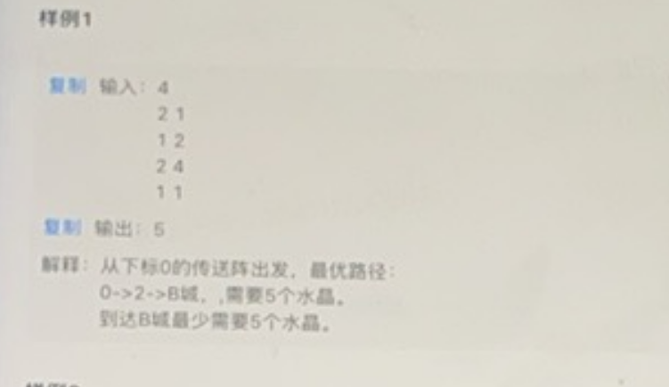

这段代码解决了一个动态规划问题，具体的题目描述可以整理如下：

---

### **题目描述**

有一个旅途需要经过 \( n \) 个地点（从 \( 1 \) 到 \( n \)），你需要支付一定的费用才能从某个地点前往下一个地点。每次最多可以连续前进 \( m \) 个地点。目标是从起点 \( 0 \) 出发到达终点 \( n \)，并且找到最小的总费用。

---

#### **输入描述**
1. 第一行包含两个整数 \( n \) 和 \( m \)：
   - \( n \) 表示目标终点的编号。
   - \( m \) 表示每次最多可以前进的地点数。

2. 第二行包含 \( n \) 个整数 \( costs[1], costs[2], ..., costs[n] \)：
   - \( costs[i] \) 表示从地点 \( i \) 开始前进需要支付的费用。

---

#### **输出描述**
输出一个整数，表示从起点 \( 0 \) 出发到终点 \( n \) 所需支付的最小费用。

---

#### **约束条件**
- \( 1 \leq n \leq 10^4 \)
- \( 1 \leq m \leq 100 \)
- \( 1 \leq costs[i] \leq 10^4 \)

---

### **题解思路**

1. **动态规划定义**：
   - 定义 `dp[i]` 为到达地点 \( i \) 所需的最小费用。

2. **状态转移方程**：
   - 对于每个地点 \( i \)，可以从 \( i-m \) 到 \( i-1 \) 范围内的任何地点跳跃过来：
     \[
     dp[i] = \min(dp[j] + costs[i-1]), \quad \text{其中 } j \in [i-m, i-1]
     \]

3. **边界条件**：
   - \( dp[0] = 0 \)：从起点出发不需要费用。
   - \( dp[i] \) 初始化为无穷大（`float('inf')`），表示不可达。

4. **结果计算**：
   - 从终点 \( n \) 向前的 \( m \) 个状态中选择最小值：
     \[
     \text{结果} = \min(dp[n-m+1], dp[n-m+2], ..., dp[n])
     \]

---

### **示例**

#### 输入：
```
5 3
5 6 2 3 4
```

#### 输出：
```
2
```
```py
def func():
    def min_pay(n,m,costs):
        dp = [float('inf')] * (n+1)
        dp[0] = 0# 不出发不要钱
        
        for i in range(1,n+1):
            for j in range(max(0,i-m),i):# 前面的状态i-m的index。走的路 items
                dp[i] = min(dp[i],dp[j] + costs[i-1])# 1 based
        return min(dp[max(0,n-m+1):n+1])
    n,m= map(int, input().split())
    costs = list(map(int, input().split()))
    print(min_pay(n,m,costs))
```





```py
import sys
def func():
  def min_energy(m, teleporters):
      # 初始化dp数组，设置为一个较大的数，表示无法到达
      dp = [float('inf')] * (m + 1)
      dp[0] = 0  # 起点不需要任何能量水品

      # 遍历每个传送阵
      for i in range(1, m + 1):
          # 尝试从所有能够到达的前面的传送阵进行跳跃
          for j in range(i-1, -1, -1):
              L, cost = teleporters[j]  # 获取传送阵的最大距离L和消耗的能量
              if i - j <= L:  # 如果可以从传送阵j跳跃到传送阵i
                  dp[i] = min(dp[i], dp[j] + cost)  # 更新最小能量

      return dp[m]

  # 输入处理
  m = int(input())  # 传送阵的数量
  teleporters = []
  for _ in range(m):
      L, cost = map(int, input().split())  # 读取每个传送阵的最大距离L和能量消耗cost
      teleporters.append((L, cost))

  # 输出最少需要携带的能量水品数量
  print(min_energy(m, teleporters))

if __name__ == "__main__":
  func()
```


```py
import sys

def func():
    def min_energy(m, teleporters):
        # 初始化dp数组，设置为一个较大的数，表示无法到达
        dp = [float('inf')] * (m + 1)
        dp[0] = 0  # 起点不需要任何能量

        # 遍历每个传送阵
        for i in range(1, m + 1):
            # 尝试从所有能够到达的前面的传送阵进行跳跃
            for j in range(i - 1, -1, -1):
                L, cost = teleporters[j]  # 获取传送阵的最大距离L和消耗的能量
                if i - j <= L:  # 如果可以从传送阵j跳跃到传送阵i
                    dp[i] = min(dp[i], dp[j] + cost)  # 更新最小能量

        # 如果终点不可达，返回 -1
        return dp[m] if dp[m] < float('inf') else -1

    # 输入处理
    m = int(input().strip())  # 传送阵的数量
    teleporters = []
    for _ in range(m):
        L, cost = map(int, input().strip().split())  # 读取每个传送阵的最大距离L和能量消耗cost
        teleporters.append((L, cost))

    # 输出最少需要携带的能量
    print(min_energy(m, teleporters))

if __name__ == "__main__":
    func()


```