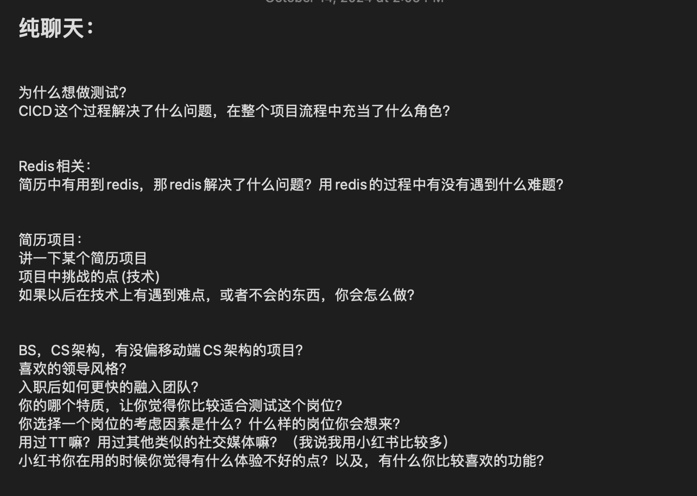

1. 面试官询问我有没有测试相关的经验，我提到我在开发项目的过程中写过一些单元测试。

2. CICD相关：面试官根据我简历上提到的在GCP基础上搭建CICD pipeline的项目，问了该项目的一些具体问题。比如：
   - 我开发了什么服务
   - 我的服务包括哪些功能
   - 我的服务是如何保证安全性的
   - 有哪几个endpoints
   - 如何为这些endpoints编写测试
   - 我是如何具体搭建CICD pipeline的

3. 代码题：给定一个字符串，去除重复字符后按字母顺序排序，并输出新的字符串，要求区分大小写。
   - 示例1: 输入 `"acbbc"`, 输出 `"abc"`
   - 示例2: 输入 `"adcabca"`, 输出 `"abcd"`

4. 案例分析：视频服务的搜索框，用户输入信息后显示结果。面试官问我如何测试该搜索功能。

5. 面试官询问我为什么想做SDET，并且建议我投递一般的SDE岗位，而不是测试岗位。

6. 反向BQ（面试官反问我问题）。


好的，如果你的CICD项目是在华为实习期间进行的，那么我们可以根据华为云的环境进行更详细的回答。在回答面试官的提问时，结合实际使用的技术栈和工具，下面是你可以回答的细致步骤：

### 1. **开发了什么服务？**

在华为实习期间，我开发了一个[具体服务名称]。这个服务主要负责[简要描述功能，例如：处理业务数据、管理用户信息或文件上传等功能]。该服务部署在华为云上，使用了华为云的[如：CCE（Cloud Container Engine）、ECS、RDS等]服务进行部署和管理。

### 2. **服务包括哪些功能？**

该服务主要提供以下功能：
- **用户管理**：包括用户注册、登录、权限分配等功能。
- **数据处理**：对[某类数据]进行自动化处理和分析。
- **文件管理**：支持文件的上传、下载以及访问控制等。
- **API接口**：提供多个RESTful API用于与前端或其他服务进行交互。

### 3. **如何保证服务的安全性？**

为了确保服务的安全性，我采取了以下措施：
- **身份验证与授权**：使用OAuth 2.0进行API层面的身份验证，确保只有合法用户能够访问相应的接口。
- **数据加密**：在数据传输过程中，通过SSL/TLS加密保证通信的安全性，避免中间人攻击。
- **华为云IAM（Identity and Access Management）**：利用华为云的IAM服务对用户角色进行精细化管理，确保最小权限原则。
- **防火墙和安全组**：配置了华为云的安全组来限制访问服务的IP地址和端口，从而减少潜在的攻击面。

### 4. **服务的Endpoints有哪些？**

服务包含多个Endpoints，主要有以下几个：
- `POST /api/v1/login`：用户登录
- `POST /api/v1/register`：用户注册
- `GET /api/v1/files`：获取文件列表
- `POST /api/v1/upload`：上传文件
- `GET /api/v1/reports`：生成并获取数据处理报告

这些Endpoints通过REST API暴露，用户可以通过HTTP请求进行访问和操作。

### 5. **如何为这些Endpoints编写测试？**

为了确保这些Endpoints的正确性，我为每个API接口编写了单元测试和集成测试：
- **单元测试**：使用了`pytest`框架，为每个接口编写了模拟请求，测试常见的场景和错误处理。通过Mock对象对数据库操作和外部依赖进行了模拟，确保只测试业务逻辑。
- **集成测试**：我还使用了Postman进行集成测试，验证API在实际运行中的行为是否符合预期，并测试不同模块之间的交互。
- **自动化测试**：这些测试集成到了CI流程中，每次代码提交后都会自动运行测试，确保代码的正确性。

### 6. **如何具体搭建CICD Pipeline？**

在华为实习期间，我基于华为云的DevCloud平台搭建了CICD Pipeline。具体步骤如下：
1. **代码仓库管理**：代码托管在华为云的代码托管服务中，并配置了Git分支策略（如使用`master`和`dev`分支）。
2. **自动化构建**：每次代码提交到`dev`分支时，华为云DevCloud的构建服务会自动触发，执行项目的编译和打包。
3. **单元测试**：在构建过程中，会自动运行预先编写好的单元测试和集成测试。如果测试失败，构建流程会自动终止。
4. **持续部署**：构建成功后，使用华为云的容器服务（CCE）或弹性云服务器（ECS）进行自动部署。新版本会自动替换旧版本，保证服务的持续可用性。
5. **通知机制**：我还配置了华为云的通知服务，每次构建完成后都会通过邮件或消息通知开发团队。

这种CICD Pipeline的自动化流程，大大提高了开发效率，减少了人为干预的错误风险。

---

### 3. **代码题：去除重复字符并排序**

完整代码如下：

```python
def remove_duplicates_and_sort(s):
    # 使用集合去重，然后排序
    unique_chars = sorted(set(s))
    # 将列表转换为字符串返回
    return ''.join(unique_chars)

# 示例输入输出
print(remove_duplicates_and_sort("acbbc"))  # 输出: abc
print(remove_duplicates_and_sort("adcabca"))  # 输出: abcd
```

### 4. **如何测试视频服务的搜索框？**

测试视频服务的搜索框可以从多个角度进行，主要包括以下几类测试：

1. **功能测试**：  
   - 输入有效的关键词，确保返回的视频列表与预期一致。
   - 输入无效的关键词，确保系统返回“无搜索结果”的提示。
   - 验证不同类型的输入（如全角字符、标点符号、空格）是否能正确处理。

2. **性能测试**：  
   - 对搜索功能进行压力测试，模拟大量用户同时发起搜索请求，检查系统的响应时间是否符合要求。
   - 测试搜索结果的加载速度，确保在高负载情况下系统依然能够快速响应。

3. **安全性测试**：  
   - 测试搜索框是否能够抵御SQL注入攻击。
   - 检查是否有必要的输入验证，防止恶意输入导致系统崩溃。

4. **用户体验测试**：  
   - 确保搜索时提供自动补全功能，帮助用户快速找到相关结果。
   - 测试搜索结果页面的布局和交互是否合理，尤其是移动端的显示效果。

### 5. **为什么想做SDET而不是SDE？**

在面试时，解释你对SDET（软件开发工程师测试）职位的兴趣，可以从以下几个方面阐述：

- **对软件质量的热情**：  
  “我对软件质量有非常强的责任感，我认为编写代码不仅仅是实现功能，还要确保代码的可靠性和可维护性。SDET的职位让我能够专注于如何通过自动化测试、CI/CD流程和质量保障手段来提升整个项目的质量。”

- **关注测试自动化和工具开发**：  
  “SDET的角色让我有机会开发测试框架和工具，这不仅让我能够编写高效的测试代码，还能为团队提供技术支持，推动开发流程的自动化。我非常喜欢这种能够整合开发与测试的角色。”

- **对于SDE职位的理解**：  
  “尽管我具备开发能力，并对SDE的工作也感兴趣，但我更希望从事能够保证软件整体质量的工作。我认为测试岗位能够让我发挥更全面的技能，从编写代码到确保代码的可靠性。”

### 6. **反向BQ（反问面试官）**

当面试官邀请你提问时，你可以考虑以下问题：

- **技术栈**：贵公司目前在CICD或测试自动化方面使用的主要技术栈是什么？
- **团队文化**：在贵公司的开发流程中，开发和测试团队是如何协作的？
- **成长空间**：作为SDET，贵公司有哪些技术和职业成长的机会？





在这个面试问题中，主要包含了几个重点话题，下面是我对每个问题的解析和参考回答。

### 1. 为什么想做测试？

“我对软件质量有很强的责任感，测试在保证软件的可靠性、稳定性和安全性方面至关重要。测试岗位不仅能够让我参与产品开发的各个阶段，还能帮助团队提高代码质量和用户体验。通过自动化测试和CI/CD流程的优化，我能够结合开发和测试技能，确保产品快速迭代时的质量稳定性。”

### 2. CICD 解决了什么问题？你在其中的角色？

“CICD的关键是实现了自动化的构建、测试和部署流程，显著提高了开发效率并减少了人为错误。通过持续集成，我们可以尽早发现并修复问题，降低了集成时的风险；通过持续部署，可以让最新的功能更快、更稳定地上线。我在团队中主要负责搭建CI/CD Pipeline，整合测试自动化、代码质量分析工具（例如SonarQube），并配置了GCP/华为云等平台的自动化部署流程。”

### 3. Redis 相关问题

- **Redis 解决了什么问题？**
  “在我的项目中，Redis主要用于缓存一些高频访问的数据，比如用户会话信息和热点数据的缓存，以减少数据库的压力和提升系统的响应速度。”

- **使用 Redis 遇到的难题？**
  “一个常见的问题是缓存失效（Cache Expiry）导致的缓存穿透和缓存雪崩。为了解决这些问题，我们设置了合理的过期策略，并通过加锁机制避免缓存击穿，同时使用Redis集群来增强缓存的高可用性和容错性。”

### 4. 简历项目：项目挑战点与解决方案

“在开发[具体项目]时，主要的挑战之一是[具体技术挑战，如：处理海量数据时的性能优化，或是在高并发情况下保持系统的稳定性]。我通过[解决方案，如：使用异步任务处理、Redis 缓存、数据库索引优化等]有效解决了这些问题。未来如果遇到不熟悉的技术难题，我通常会通过阅读官方文档、参与技术社区讨论，或者向团队中有经验的同事请教。”

### 5. 移动端项目和BS、CS架构

“我参与过偏向于B/S架构的项目，这些项目主要基于前后端分离，通过RESTful API进行数据交互。虽然没有直接开发过移动端CS架构的项目，但我对客户端架构有一些基础了解，也参与过一些移动端相关的测试项目。”

### 6. 领导风格 & 融入团队

- **喜欢的领导风格**：“我更喜欢开放且注重反馈的领导风格，领导能够给团队提供明确的目标，并且鼓励团队成员提出自己的想法。这样的工作环境能让我更好地发挥主动性和创新能力。”

- **如何融入团队**：“我在融入团队时，会首先了解团队的工作流程和文化，并且主动和同事沟通，参与团队讨论，帮助其他成员解决问题。在工作中，我也会努力通过不断学习提升自己，并积极参与团队的代码审查和技术讨论。”

### 7. 为什么适合测试岗位？

“我有很强的细节关注能力和耐心，并且喜欢分析和解决复杂的问题。此外，我拥有开发经验，能够编写高效的自动化测试代码，搭建测试框架，确保项目在各个环节的质量。我的背景让我不仅能专注于找到问题，还能提供有效的解决方案，帮助团队从开发到交付的整个流程中提升质量。”

### 8. 小红书使用体验

- **体验中的问题**：“在小红书使用过程中，有时发现搜索的相关性不够高，尤其是某些特定关键词的搜索结果。还有一些用户反馈页面加载速度稍慢。”
  
- **喜欢的功能**：“我很喜欢小红书的推荐算法和内容互动功能，它能够根据用户的兴趣快速推荐相关内容，这对于提升用户粘性和浏览体验非常有帮助。” 

希望这些回答能帮助你更好地准备面试！


好的，下面我会更加详细地解答CICD相关的内容，以及Redis在项目中遇到的问题和解决方案，帮助你在面试中能有更加细致的表达。

---

### **CICD 相关问题**

#### **CICD 解决了什么问题？在项目流程中你承担了什么角色？**

CICD（持续集成与持续部署）在现代软件开发中，主要解决了开发过程中的两个核心问题：**代码集成的频繁冲突**和**手动部署带来的风险**。

1. **解决的问题**：
   - **持续集成（CI）**：通过自动化的方式，每次代码提交时，系统会自动进行构建、运行单元测试和集成测试，保证新的代码不会引入问题。在没有CI之前，团队往往会在一段时间内由不同的开发人员提交代码，最后再进行大规模的合并，这时常会导致“集成地狱”，即各种代码冲突和错误。CI系统通过频繁的小步提交和自动测试，避免了这种问题。
   - **持续交付和持续部署（CD）**：CICD流水线将测试通过的代码自动部署到测试环境或生产环境，消除了手动部署时可能带来的错误。这提高了部署的可靠性和速度，特别是对于频繁发布的项目，这种自动化流程可以节省大量的时间和精力。

2. **我在其中的角色**：
   - **设计与实现CICD流水线**：在团队中，我负责设计和实现CICD Pipeline。我使用了[你使用的工具，如GitLab CI, Jenkins, 或GCP的Cloud Build等]搭建整个流程，从代码的提交、构建、测试、到最后的自动部署。  
   - **测试自动化集成**：我将自动化测试集成到CI流水线中，确保每次提交代码后，系统会自动执行单元测试、集成测试和功能测试，确保代码的正确性和稳定性。
   - **自动化部署**：在CD阶段，我负责将应用部署到[如：GCP, AWS, 华为云等]平台上的生产环境。我使用了容器技术（如Docker）和Kubernetes等工具，使得整个部署流程可以轻松扩展和管理。
   - **代码质量监控**：我还集成了代码质量分析工具（例如SonarQube），确保每次构建时不仅仅是运行测试，还能对代码的质量进行全面检查，包括代码复杂度、潜在的安全漏洞等。

#### **CICD Pipeline 的具体步骤**：

我的CICD Pipeline主要包括以下步骤：

1. **代码提交（Commit）**：  
   每次开发人员推送代码到Git仓库（如GitHub, GitLab），这会触发CICD Pipeline的执行。
   
2. **自动构建（Build）**：  
   系统会拉取最新的代码，并进行自动构建。在这个过程中，我配置了Maven/Gradle（如果是Java项目）、NPM（如果是JavaScript项目）等构建工具进行依赖管理和代码编译。
   
3. **单元测试（Unit Testing）**：  
   构建成功后，系统会自动运行预先编写的单元测试，确保每个模块的功能在更新代码后依然能够正常工作。我们使用`pytest`（Python项目）或者`JUnit`（Java项目）等测试框架来执行这些测试。

4. **代码质量检查（Code Quality Check）**：  
   在测试过程中，我集成了SonarQube等工具，对代码的静态质量进行分析，检查代码是否符合代码规范，是否有潜在的安全漏洞或代码复杂度过高的问题。

5. **集成测试（Integration Testing）**：  
   单元测试完成后，流水线会进入集成测试阶段，验证不同模块之间的协同工作是否正常。我使用了Postman等工具模拟API请求，确保后端服务可以正确响应。

6. **打包与部署（Package and Deploy）**：  
   测试通过后，代码会被打包为Docker镜像，并推送到容器镜像仓库中（如Docker Hub, Google Container Registry）。随后，流水线会自动将最新的镜像部署到预生产或生产环境中。部署使用了Kubernetes的滚动更新策略，保证系统在部署新版本时不会影响正在使用的用户。

7. **通知与监控**：  
   每次Pipeline运行完成后，我配置了自动通知机制，团队成员可以通过邮件、Slack等方式收到构建和部署的状态更新。此外，部署后我们会利用Prometheus和Grafana等工具进行服务监控，确保在生产环境中的服务运行正常。

---

### **Redis 相关问题**

#### **Redis 解决了什么问题？**

Redis 是一个高效的内存数据存储，在我的项目中主要解决了以下几个问题：

1. **数据缓存**：  
   在高并发场景下，直接访问数据库会带来性能瓶颈。Redis作为缓存，能够将常用的数据（如用户会话、热门商品、首页推荐内容）存储在内存中，极大地降低了数据库的读写压力，提升了系统的响应速度。通过将数据库查询结果缓存到Redis中，后续的请求可以直接从缓存获取数据，避免了多次重复查询数据库的性能开销。

2. **分布式锁**：  
   在一些需要保证分布式一致性的场景下，我们使用了Redis的分布式锁来确保某些操作不会被多次并发执行。例如在订单系统中，避免了用户在并发提交订单时出现的超卖问题。通过Redis的`SETNX`命令和过期时间，我们可以实现高效的锁定机制，保证操作的原子性。

3. **消息队列**：  
   在某些场景下，我们需要将任务进行异步处理。Redis的List数据结构可以用于实现简单的任务队列。当用户提交任务后，将任务推送到Redis队列中，后台服务异步地从队列中取出任务进行处理，减少了用户的等待时间。

#### **使用 Redis 过程中遇到的挑战与解决方案**：

1. **缓存穿透**：  
   缓存穿透是指大量请求查询不存在的数据，导致请求直接落到数据库，绕过了缓存。为了防止这种情况，我采用了**布隆过滤器（Bloom Filter）**来预先过滤掉明显不存在的请求，从而避免对数据库的额外压力。

2. **缓存雪崩**：  
   当大量缓存同时失效时，会导致瞬间大量请求直接打到数据库，可能引发数据库崩溃。为了解决这个问题，我采取了**随机化缓存失效时间**的策略，避免缓存数据在同一时刻集中失效。此外，还对某些关键数据设置了**双缓存机制**，确保缓存过期时，依然能够提供旧的数据，直到新的缓存被重新构建。

3. **缓存击穿**：  
   缓存击穿是指当某些热点数据的缓存失效后，大量请求同时查询这个数据，直接请求数据库的情况。我通过**设置互斥锁**，确保只有一个请求可以查询数据库并更新缓存，其他请求只能等待缓存更新完成。

---

### 总结

在面试中，如果涉及CICD或Redis的相关问题，你可以参考这些详细的回答，展示你对项目中技术难题的理解和解决方案，体现出你在这些技术方面的实际经验和深入思考。这不仅能帮助你赢得面试官的认可，也能证明你有能力在复杂项目中应用这些技术。

在Jenkins中搭建CICD流水线的过程涉及到多个步骤，涵盖从项目代码的构建、测试、到部署的自动化流程。下面是一个详细的回答，解释如何使用Jenkins来实现CICD Pipeline，并结合一些常见的实际操作和场景，帮助你在面试中更清晰地描述你的经验。

---

### **使用 Jenkins 实现 CICD 流程**

Jenkins 是一个广泛使用的开源自动化服务器，常用于构建、测试和部署软件项目。通过配置Pipeline（流水线），Jenkins可以实现CI/CD的整个流程。下面是Jenkins在CICD流程中的使用步骤和配置细节：

#### **1. 安装 Jenkins 并配置环境**

- **安装 Jenkins**：
  Jenkins 可以通过多种方式安装，如在本地使用 `.war` 包运行，或者直接在服务器上使用 Docker 容器部署。可以通过访问 Jenkins 官方页面获取最新安装包，安装后访问Jenkins的Web界面进行进一步的配置。

- **环境配置**：
  在开始使用 Jenkins 构建项目之前，需要配置环境。你需要设置Jenkins的环境变量，安装所需的插件（如：Git, Docker, Kubernetes, SonarQube等），并确保Jenkins服务器能够访问代码仓库和部署环境。

#### **2. 创建 Jenkins 项目**

在 Jenkins 中，可以创建不同类型的项目来实现不同的CI/CD流程。通常，我们会选择以下两种方式：

- **自由风格项目（Freestyle Project）**：适合简单的构建流程，可以通过表单配置来实现CI/CD。
- **Pipeline 项目**：适合复杂的工作流，使用Jenkinsfile（以代码定义流水线）来管理构建、测试、部署的过程。这种方式更加灵活，也是目前主流推荐的方式。

#### **3. 使用 Jenkinsfile 配置 Pipeline**

**Jenkinsfile** 是 Jenkins Pipeline 的配置文件，它使用声明式语法（Declarative Pipeline）或脚本式语法（Scripted Pipeline）定义整个CICD流程。我们通常将 `Jenkinsfile` 存放在项目的根目录中，Jenkins每次从Git仓库中拉取代码时会自动执行该文件中的指令。

```groovy
pipeline {
    agent any  // 指定在任意可用的节点上运行

    environment {
        // 定义环境变量
        DOCKER_IMAGE = "my-app:${env.BUILD_ID}"
        REGISTRY = "my-docker-registry.com"
    }

    stages {
        stage('Checkout') {
            steps {
                // 从Git仓库检出代码
                git branch: 'main', url: 'https://github.com/your-repo.git'
            }
        }

        stage('Build') {
            steps {
                // 使用Maven构建项目
                sh 'mvn clean package'
            }
        }

        stage('Test') {
            steps {
                // 运行单元测试
                sh 'mvn test'
            }
            post {
                always {
                    // 生成测试报告
                    junit '**/target/surefire-reports/*.xml'
                }
            }
        }

        stage('Code Quality Check') {
            steps {
                // 使用SonarQube检查代码质量
                withSonarQubeEnv('My SonarQube') {
                    sh 'mvn sonar:sonar'
                }
            }
        }

        stage('Build Docker Image') {
            steps {
                // 构建Docker镜像
                sh "docker build -t ${REGISTRY}/${DOCKER_IMAGE} ."
            }
        }

        stage('Push to Docker Registry') {
            steps {
                // 将镜像推送到Docker Registry
                sh "docker push ${REGISTRY}/${DOCKER_IMAGE}"
            }
        }

        stage('Deploy to Kubernetes') {
            steps {
                // 使用kubectl将镜像部署到Kubernetes集群
                sh 'kubectl apply -f deployment.yaml'
            }
        }
    }

    post {
        success {
            // 在流水线成功时发送通知
            mail to: 'team@example.com', subject: "Build Success: ${env.BUILD_ID}", body: "The build was successful."
        }
        failure {
            // 在流水线失败时发送通知
            mail to: 'team@example.com', subject: "Build Failure: ${env.BUILD_ID}", body: "The build has failed."
        }
    }
}
```

#### **4. 详细解释各个阶段**

- **`agent`**：指定流水线运行的节点。`any`表示在任何可用的节点上执行任务。你也可以指定特定的节点标签。
  
- **`environment`**：定义环境变量，如Docker镜像的版本号、Docker Registry地址等。这些变量可以在流水线的各个阶段中使用。

- **`stages`**：流水线的核心部分，每个阶段（`stage`）代表CICD流程中的一个步骤。

  1. **Checkout 阶段**：  
     在这个阶段，Jenkins会从指定的Git仓库中检出代码。你可以通过分支名指定要拉取的分支（如：`main`或`develop`）。

  2. **Build 阶段**：  
     使用Maven进行项目的构建。Maven是Java项目常用的构建工具。如果是其他项目类型，也可以使用相应的构建工具（如NPM，Gradle等）。

  3. **Test 阶段**：  
     在这个阶段，运行项目的单元测试，确保代码的正确性。执行完成后，Jenkins会自动收集测试结果，并生成JUnit格式的测试报告。

  4. **Code Quality Check 阶段**：  
     使用SonarQube进行代码质量检查，检测代码中的潜在问题，如安全漏洞、代码复杂度等。Jenkins会调用SonarQube的API，检查完成后生成质量报告。

  5. **Build Docker Image 阶段**：  
     Jenkins会使用Dockerfile来构建应用的Docker镜像。镜像的标签是通过流水线中的环境变量动态生成的，确保每次构建的镜像版本唯一。

  6. **Push to Docker Registry 阶段**：  
     将构建好的Docker镜像推送到指定的Docker镜像仓库（如Docker Hub, Google Container Registry）。这一步确保我们可以随时从镜像仓库中拉取最新版本的镜像。

  7. **Deploy to Kubernetes 阶段**：  
     使用`kubectl`命令将镜像部署到Kubernetes集群。`deployment.yaml`文件定义了Kubernetes集群中的部署策略，如副本数量、服务端口、滚动更新等。

#### **5. 配置 Jenkins 触发器**

Jenkins 可以配置多种触发器来自动启动Pipeline：

- **基于时间的触发器**：你可以通过`cron`表达式，定时触发流水线。例如，每天晚上12点进行自动化测试。
  
  ```groovy
  triggers {
      cron('H 0 * * *')  // 每天午夜触发
  }
  ```

- **基于 Git 的 Webhook 触发**：  
  配置GitHub或GitLab的Webhook，当有代码提交或Pull Request时，自动触发Pipeline执行。

#### **6. 部署后的监控与通知**

- **邮件通知**：在流水线执行成功或失败后，Jenkins可以自动发送邮件通知相关开发人员，帮助他们及时了解构建状态。
  
- **日志与监控**：Jenkins自动生成的日志和控制台输出可以帮助你排查Pipeline中的问题。此外，还可以结合Prometheus、Grafana等工具对Jenkins自身的运行状态进行监控。

---

### **总结**

通过Jenkins搭建CICD流水线，能够大幅提高项目的自动化水平，减少人为操作的错误，并且通过集成测试、代码质量检查、Docker构建和Kubernetes部署，可以实现整个从代码提交到生产环境发布的全流程自动化。在面试中，你可以根据上述流程，结合你具体参与的项目来描述你在使用Jenkins进行CICD时的经验和做法。