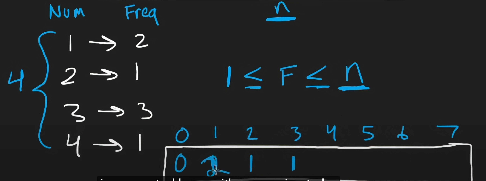

### 相同的数子move to the last 最后一个, 且在区间内
```py
            while i+1 < len(nums) and nums[i] == nums[i+1]:
                i +=1
        # 右边的大的话（上升）且在范围的情况，因为mid+1 检查右边就行
            if mid < len(nums) - 1 and nums[mid] < nums[mid+1]:
        # 在范围内，左边大的话（下降） 且在范围内的情况，因为i-1
        if mid > 0 and nums[mid] < nums[mid-1]:
```
### 旋转数组的左右边 都是跟  L比 或者nums【0】，右边就是nums【-1】
```
        # 搜索左半部分
        if nums[l] <= nums[mid]
        # 搜索右半部分
        if nums[mid] < nums[l]
```
### least number of unique integer after k removal
### elminate/remove the smallest frequency number
```py
heapify 是 linear time，pop是logn，但是heap比sort 更快
def findLeastNumOfUniqueInts(self,arr,k):
    freq = Counter(arr)
    heap = list(freq.values())
    heapq.heapify(heap)

    res = len(heap)
    while k >0:
        f = heapq.heappop(heap)
        if k >= f:
            k -= f
            res -=1
    return res
```


### freq with bucket sort
不care number是几，只在乎freq是1的两个，2的1个

因为least肯定是freq频率最少的先去除，能整个去掉最好， 
和上面不一样的是有两个数字的 freq都是这个的话，结果是-2的，有几个-几个
freq[1] 在freq——list里面代表 频率1 的有几个
### 如果不能全部移除的话 math， k/f round down看看自己能移除几个
```py
freq = Counter(arr)
freq_list = [0] *(len(arr)+1 )
for n,f in freq.items():
    freq_list[f] +=1
res = len(freq)
for f in range(1,len(freq_list)):
    remove = freq_list[f] # 移除的freq【n】 某个频率的数
    if k >= f *remove:
        k -= remove
        res -= remove
    else:
        remove = k//f
        res -= remove
        break # 下面的没有必要了
return res
```

### 本质上@cache就是用hashmap来记录所有的
### 初始化n个【-1】不可能的，然后记录每一次得到的值 cache[i] = res, 在下一步计算前，查看cache有没有，就index那个数字
### 有的话直接返回那个数字好了，不用返回结果，  if cache[i] != -1: return cache[i]

### 
```py
class Solution:
    def rob(self,nums):
        n = len(nums)
        @cache
        def dfs(i):
            if i <0:
                return 0 
            res = max(dfs(i-1),dfs(i-2)+nums)
            return res
        return dfs(n-1)

#本质上cache就是用hashmap来记录所有的
# 初始化n个【-1】不可能的，然后记录每一次得到的值 cache[i] = res, 在下一步计算前，查看cache有没有，就index那个数字
# 有的话直接返回那个数字好了，不用返回结果，  if cache[i] != -1: return cache[i]
    def rob(self,nums):
        n = len(nums)
        cache = [-1] *n
        def dfs(i):
            if i <0:
                return 0 
            if cache[i] != -1:
                return cache[i]
            res = max(dfs(i-1),dfs(i-2)+nums)
            cache[i] = res
            return res
        return dfs(n-1)
```


### @property 是 Python 中的一个装饰器，用于将一个方法转换为属性。这使得你可以使用点符号来访问方法的返回值，而不需要调用它。
```py

    @property
    def radius(self):
        """获取半径"""
        return self._radius

circle.radius
```
```py
    class Circle:
    def __init__(self, radius):
        self._radius = radius

    def get_radius(self):
        """获取半径"""
        return self._radius
        
circle.get_radius()
```

### 
```py

```


### 
```py

```


### 
```py

```


### 
```py

```


### 
```py

```


### 
```py

```


### 
```py

```


### 
```py

```


### 
```py

```


### 
```py

```


### 
```py

```


### 
```py

```


### 
```py

```

### 
```py

```

### 
```py

```

### 
```py

```
### 
```py

```
### 
```py

```
### 
```py

```
### 
```py

```
### 
```py

```
### 
```py

```

### 
```py

```
### 
```py

```
### 
```py

```
